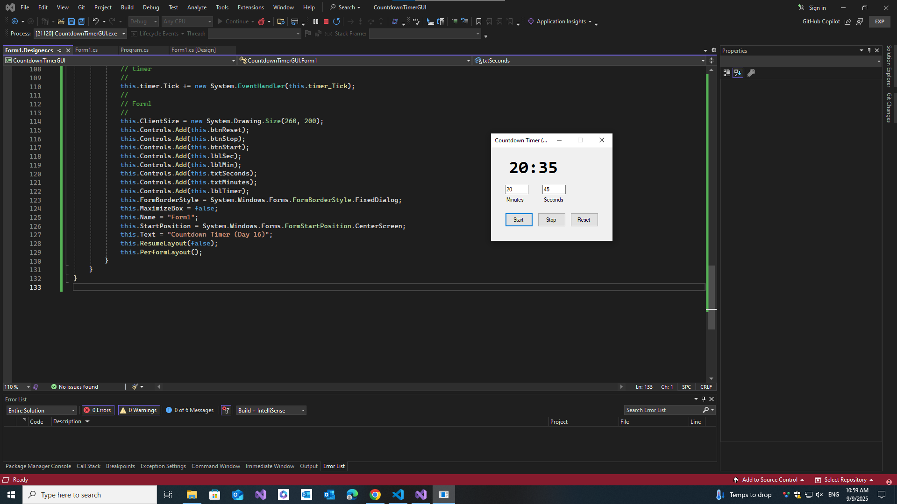

# ⏳ Countdown Timer GUI (C# WinForms App)

This is Day 16 of my 30-Day C# Project-Based Learning Plan.
A simple Countdown Timer desktop app built with Windows Forms in C#.
It lets the user enter minutes/seconds, start a countdown, pause, reset, and plays a sound when time is up.

---

## 🚀 Features

- **User Input** → Enter minutes and seconds.

- **Start Button** → Begins countdown.

- **Stop Button** → Pauses countdown.

- **Reset Button** → Clears time and resets UI.

- **Real-time Timer** → Updates label every second.

- **Alarm** → Plays a system sound + shows message when countdown ends.

  ---

## 🛠️ Tech Stack

- C# 7.3

- .NET Framework / WinForms

- Visual Studio IDE

----

## 📸 Screenshots

| ⏳ | 
|--------------|
|  |

----

## 📚 Learning Goals

This project helped me practice:

- Reading user input with TextBox.

- Validating and converting time input.

- Using Timer to update countdown.

- Triggering events when countdown reaches zero.

- Formatting time as mm:ss.
